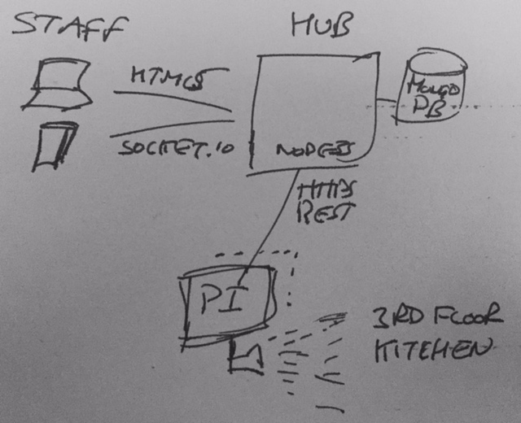

# hackathon2015-hornby-hub - Hornby Toads

IoT hub by the Hornby Toads team for the 2015 Intelliware IoT hackathon

## Intro

Is now a good time to go to the kitchen for a coffee and a chat? Or is now a good time to go to the kitchen while there are no queues? What about the kitchens on the other floors? Or the bathroom...

Our hackathon project aimed to solve these problems by harnessing a Raspberry PI with a video camera paired with a NodeJS server and AngularJS frontend.

See the PI camera client: https://github.com/Intelliware/hackathon2015-hornby-pi/blob/master/README.md

## Live Demo
A live demo is running on Heroku:
https://hackathon2015-hornby.herokuapp.com

It might take a few seconds for the server to initially respond as the dyno is spun up.

Note that the database is reset daily.

## Prerequisites

The hub was generated from the angular fullstack generator and so has the same prerquisites as it:
https://github.com/DaftMonk/generator-angular-fullstack

Here are the technologies that you will need to install:
- nodejs/npm
- yeoman
- bower
- compass
- MongoDB

- bower install
- npm install

## Running

To run a local copy of the server:
- grunt serve
